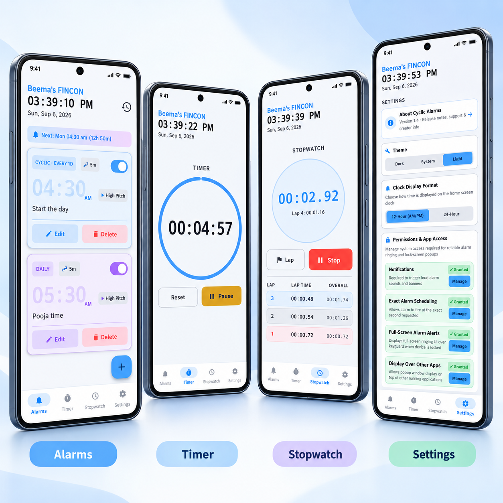

# Beema's FINCON — Cyclic Alarms

> A simple, **100% ad-free** alarm app built for people who work shift schedules, rotating rosters, or any repeating cycle that doesn't fit a standard Mon–Fri pattern.

---

## What this app does

Most alarm apps only support weekly repeats — same days every week. If your work schedule repeats every 3 days, every 5 days, or any other interval, you're stuck setting alarms manually each time.

**Cyclic Alarms** solves exactly that. You pick a start date and an interval, and the alarm fires on that cycle forever — no manual resetting needed.

It also supports regular weekly alarms (pick any days of the week), so it covers everyday use too.

That's it. No subscriptions, no ads, no accounts, no permissions beyond what's needed to actually ring an alarm.

---

## Features

- **Cyclic alarms** — repeat every N days from a start date (e.g. every 3 days, every 14 days)
- **Weekly alarms** — pick any combination of weekdays
- **Multiple Timers** — run up to 5 independent countdown timers simultaneously, each with its own label and progress bar
- **Stopwatch** — elapsed time tracker with lap recording, fastest/slowest lap highlights, and touch audio feedback
- **Background Timer & Stopwatch** — continue running when the app is backgrounded via a Foreground Service with a persistent, non-dismissible notification (like YouTube playback) — shows live countdown and a "Stop All" action
- **Persistent Custom Track** — last-used audio file is automatically pre-applied to every new alarm; no need to re-pick each time
- **Rings in Silent & DND Mode** — alarm stream volume is forced to maximum before playing, bypassing silent/vibrate mode
- **Pure Dark Mode** — true AMOLED black theme for OLED screens (saves battery, looks sharp)
- **Dark / Light / System themes** — with a brightness slider in Light mode to dial background from tinted grey to pure white
- **In-App Auto-Update** — tap "Check for Updates" in About to fetch the latest GitHub release, download the APK, and launch the system installer
- **Automatic Update Banner** — detects new GitHub releases on launch and shows a prompt at the top of the Alarms tab
- **Firebase Cloud Messaging (FCM)** — broadcast push notifications and developer announcements
- **Strict Lock Screen Security** — app ONLY displays over keyguard while actively ringing; dismiss/snooze immediately returns to lock screen
- **4-Tab Navigation** — Alarms, Timer, Stopwatch, Settings
- **12H / 24H Clock Toggle** — with capital AM/PM and full year on the home screen date
- **Per-Alarm Snooze Duration** — set snooze minutes per alarm (quick presets + custom input)
- **First-launch Theme Prompt** — pick your theme on first install, with correct status bar contrast
- **In-App Permissions Manager** — view and manage all critical permissions live in Settings
- **Alarm history** — log of dismissed and snoozed alarms with clear option
- **8 built-in alarm sounds** — High Pitch, Zen Bowl, Sunrise Chime, Digital Beeps, Morning Forest, Synth Wave Beat, Cyber Alert, Lofi Chord
- **Custom audio** — use any audio file from your device as an alarm sound
- **Volume & vibration control** — per-alarm, volume defaults to maximum
- **Expandable release notes** — collapsible version history on the About page
- **Zero ads. Zero tracking. Zero sign-in.**

---

## Screenshots

  

---

## Installation

This app is **not on the Play Store**. Install it by sideloading the APK:

1. Download `app-release.apk` from the [Releases](../../releases) page
2. On your Android phone, go to **Settings → Apps → Special app access → Install unknown apps**
3. Allow installs from your browser or file manager
4. Open the downloaded APK and tap Install

### ⚠️ Google Play Protect warning

When you install this APK, Google Play Protect may show a warning saying the app is unrecognized. This is **normal and expected** for any APK that isn't distributed through the Play Store.

The app is completely safe. Here's the honest context:

- I'm not a professional developer — I'm an amateur who built this for my own use
- The app is not signed with a Play Store key, which triggers the warning automatically
- There is no malware, no tracking, no network calls of any kind — it's a local alarm app
- You're welcome to read the full source code in this repository

You can tap **"Install anyway"** safely.

---

## Tech stack

- **Language:** Kotlin
- **UI:** Jetpack Compose (Material 3)
- **Data:** Room database (SQLite)
- **Audio:** Android AudioTrack + MediaPlayer — all synth sounds are generated in code, no audio files bundled
- **Scheduling:** AlarmManager with exact alarms
- **Min SDK:** Android 7.0 (API 24)

---

## AI disclosure

This app was built **100% using AI assistance** (Google Antigravity AI / Claude). Every line of Kotlin, every layout, every fix — written by AI based on my descriptions of what I wanted.

I'm not a software developer. I'm just someone who needed a specific alarm app, couldn't find one that did exactly what I wanted, and used AI to build it. The ideas, requirements, and testing are mine — the code is the AI's.

---

## What's new — v1.6

- 🔔 **Non-dismissible background notification** — timer & stopwatch notification cannot be swiped away while running (just like a YouTube playback notification); includes a "Stop All" action button so you can still stop from the shade
- 🎨 **Light mode alarm time fix** — cyclic and weekly alarm times now use deep, high-contrast colours (deep blue / deep purple) instead of the washed-out near-white tints that were invisible on a light background
- 🌤 **Deeper light mode tint** — default background is a more noticeably grey-blue so the whiteness slider feels meaningful and usable across its full range

## What's new — v1.5

- 🎵 **Persistent Custom Track** — last-used music file auto-applied to every new alarm
- ⏱ **Multiple Timers** — run up to 5 independent countdown timers simultaneously
- 🌑 **Pure Dark Mode** — true AMOLED black theme for OLED screen battery savings
- ☀️ **Light Mode Brightness Slider** — adjust background from tinted grey to pure white in Settings
- 🔄 **Background Timer & Stopwatch** — continue running when app is backgrounded via Foreground Service
- 🔔 **Rings in Silent & DND Mode** — alarms bypass ringer volume; one-time info banner confirms this
- ⬆️ **In-App Auto-Update** — tap "Check for Updates" in About to download & install new releases directly

## What's new — v1.4

- 🔥 **Firebase Cloud Messaging (FCM)** — integrated real-time cloud push notifications and developer announcements; instant notification delivery when new updates or releases are ready
- 🏷 **Official Package Name** — rebranded package identity to `com.beemasfincon.cyclicalarms`
- 📡 **Instant Broadcast Topics** — app devices automatically subscribe to `announcements` and `all` topics for seamless broadcast messages directly from the Firebase Console
- 🚀 **GitHub Auto-Update Checker** — detects new GitHub releases on launch and prompts with a 1-tap APK download link

## What's new — v1.3

- ⏱ **Timer** — built-in countdown timer with circular progress ring; time-set (HH:MM:SS) and quick presets (1m–30m) displayed **inside** the clock ring for a single-glance view; alert sound & vibration on completion
- ⏱ **Stopwatch** — millisecond-precision elapsed time tracker with lap recording, fastest/slowest lap highlights, button audio feedback, and a scrollable lap list
- 🔒 **Strict Lock Screen Security** — after dismissing or snoozing, the phone immediately returns to lock screen without exposing the main dashboard; keyguard access is scoped strictly to the ringing moment
- 🚀 **Auto-Update Checker** — detects new GitHub releases on launch and prompts with a 1-tap APK download link
- 🔔 **Welcome Notification** — first-launch welcome message shown to new installs
- 🎵 **Timer & Stopwatch Sounds** — timer fires system alarm ringtone + vibration; stopwatch uses audio tones on lap/start for tactile feedback
- 📱 **4-Tab Navigation + Embedded About** — Alarms, Timer, Stopwatch, Settings; About is a sub-page inside Settings
- 🌀 **Default Cyclic Days** — new alarms open on Cyclic Days tab by default
- 🖼 **Icon Fit Fix** — app icon no longer appears cropped or zoomed in on the launcher
- 🛡 **Permission Gate** — if critical permissions (Exact Alarm, Full-Screen Intent, Overlay) are not granted, the app shows a clear blocking screen with one-tap "Grant" buttons for each missing permission; app is unusable until all are granted
- ⚡ **Real-time Permission Status** — the Settings screen now re-reads all permission states the moment you return from system settings, no force-close needed
- 📋 **History Icon** — the Alarm History button now uses the correct clock-history icon instead of a generic list icon

## What's new — v1.2

- 🌀 **Pencil-Sketched Spiral Alarm Icon** — brand new centered, symmetrical pencil-sketched spiral alarm clock launcher icon
- ⏱ **Per-Alarm Custom Snooze** — set desired snooze duration per alarm (quick preset chips + custom minute input) instead of global setting
- 🔒 **Native Lock Screen Ringing** — rings over keyguard cleanly without prompting for PIN/password unlock
- 📱 **Dedicated Page Navigation** — full 4-tab bottom navigation bar for Alarms, History, Settings, and About
- 🕒 **12H / 24H Clock Toggle** — choose 12-Hour (uppercase "AM"/"PM") or 24-Hour format on the home screen clock
- 📅 **Year display in date** — home screen date format now displays the full year (e.g. Sat, Sep 5, 2026)
- 🎨 **First-Launch Theme Prompt & Status Bar Visibility** — asks theme preference on first install and ensures status bar icons stay visible on light themes
- 🔑 **In-App Permissions Manager** — live permission status badges and direct settings management in Settings
- ✉️ **Support & Community Card** — moved to About page for easy feedback & bug reporting (`bp.beema@outlook.com`)
- 📂 **Expandable Release Notes** — collapsible release note cards on About page for clean readability

## v1.1

- 🌙 Dark / Light / System theme selector in Settings
- 🕐 Alarm editor now defaults to current time
- 👁 Minute spinner visibility fix
- 🔔 New **High Pitch** alarm sound — loud dual-tone alert (2400 Hz + 3200 Hz)
- 🔊 Volume defaults to maximum for new alarms
- 🏷 "Beema's FINCON" branding on home screen

## v1.0 — Initial release

- Cyclic alarms (every N days)
- Weekly alarms (any day combination)
- 7 synth sounds + custom audio file support
- Lock screen ringing
- Snooze, vibration, alarm history

---

## Feedback

Open the **About** page in the app and tap **"Feedbacks, Suggestions or Bugs Reporting"** to send feedback directly by email to `bp.beema@outlook.com`. Or open an issue here on GitHub.

---

## License

This project has no formal license. Use it, fork it, do whatever you want with it.
